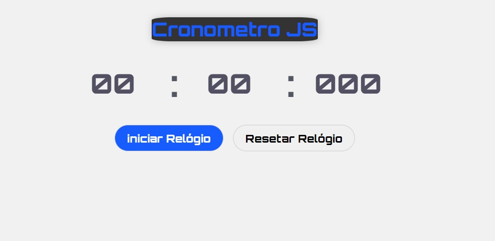

## <h1 > Cronometro JS </h1>
## <h3> Projeto do  Hora de Codar </h3>
## <h3> Projeto usando HTML CSS e JS</h3>
## <h3> Imagem do Projeto </h3>

    <figure>
        
        <figcaption> Imagem do Cronometro </figcaption>
    </figure>

